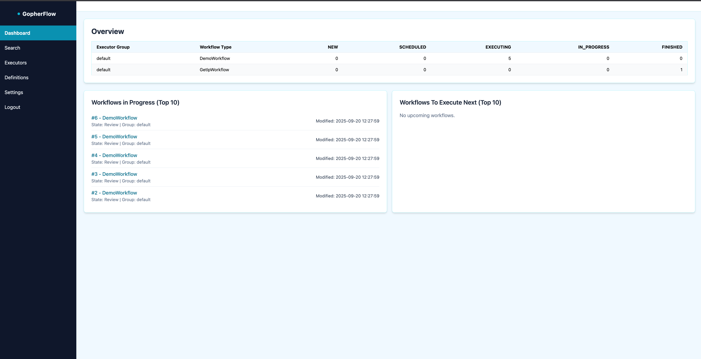
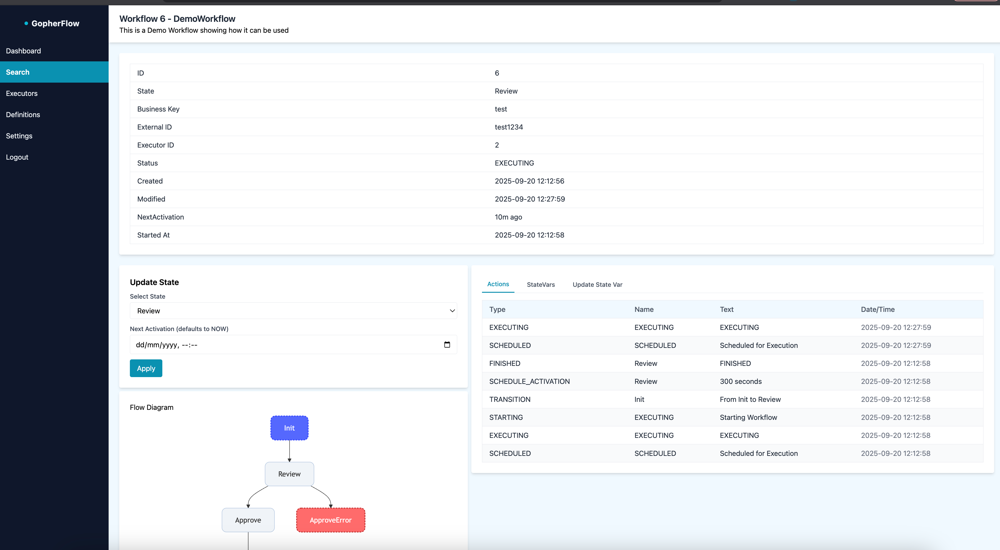
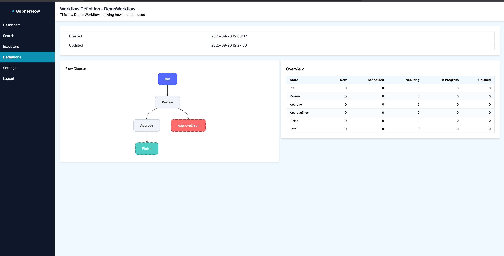

# GopherFlow

Small, pragmatic workflow engine for Go with a built-in web console. Define workflows in Go, persist their execution, and observe/operate them via the web UI.

<p align="center"></p>

## Highlights

- Define workflows in Go using a state-machine approach
- each function is idempotent and can be retried
- Persistent storage (Postgres, SQLite, Mysql supported) with action history
- Concurrent execution with executor registration, heartbeats, and stuck-workflow repair
- Web console (dashboard, search, definitions with diagrams, executors, details)
- Mermaid-like flow visualization generated from workflow definitions
- Container-friendly, single-binary deployment

## Quick start

Prerequisites:
- Go 1.24+ (or Docker if you prefer containers)

## Demo Application
This starts the demo application with a SQLite database, there are two workflows

* DemoWorkflow - does some ficticious steps and adds some variables
* GetIpWorkflow - gets the current public IP address from ifconfig.io and puts it into a state variable

        docker run -p 8080:8080 \
        -e GFLOW_DATABASE_TYPE=SQLLITE\
        -e GFLOW_DATABASE_SQLLITE_FILE_NAME=/data/gflow.db\
        -v "$(pwd):/data"\
        --security-opt seccomp=unconfined \
        juliangpurse/gopherflow:1.3.1

*note the --security-opt seccomp=unconfined  is required because of sqllite being run in a container*

Access the web console at http://localhost:8080/

    Username : admin
    Password : admin

## Web Console

<p align="center">



</p>


## Building your own Workflow and running it

refer to the example application:  https://github.com/RealZimboGuy/gopherflow-examples

### Specific details

    go get github.com/RealZimboGuy/gopherflow@v1.3.1

a struct that extends the base 
```go
type GetIpWorkflow struct {
core.BaseWorkflow
}
```
the workflow interface must be fully implemented

```go
type Workflow interface {
StateTransitions() map[string][]string // map of state name -> list of next state names
InitialState() string // where to start
Description() string
Setup(wf *domain.Workflow)
GetWorkflowData() *domain.Workflow
GetStateVariables() map[string]string
GetAllStates() []models.WorkflowState 
GetRetryConfig() models.RetryConfig
}

```
### Here is the example for the GetIpWorkflow

```go
import (
"github.com/RealZimboGuy/gopherflow/pkg/gopherflow/core"
domain "github.com/RealZimboGuy/gopherflow/pkg/gopherflow/domain"
models "github.com/RealZimboGuy/gopherflow/pkg/gopherflow/models"

	"io"
	"log/slog"
	"net/http"
	"time"
)

// Define a named string type
var StateStart string = "Start"
var StateGetIpData string = "StateGetIpData"

const VAR_IP = "ip"

type GetIpWorkflow struct {
core.BaseWorkflow
}

func (m *GetIpWorkflow) Setup(wf *domain.Workflow) {
m.BaseWorkflow.Setup(wf)
}
func (m *GetIpWorkflow) GetWorkflowData() *domain.Workflow {
return m.WorkflowState
}
func (m *GetIpWorkflow) GetStateVariables() map[string]string {
return m.StateVariables
}
func (m *GetIpWorkflow) InitialState() string {
return StateStart
}

func (m *GetIpWorkflow) Description() string {
return "This is a Demo Workflow showing how it can be used"
}

func (m *GetIpWorkflow) GetRetryConfig() models.RetryConfig {
return models.RetryConfig{
MaxRetryCount:    10,
RetryIntervalMin: time.Second * 10,
RetryIntervalMax: time.Minute * 60,
}
}

func (m *GetIpWorkflow) StateTransitions() map[string][]string {
return map[string][]string{
StateStart:     []string{StateGetIpData}, // Init -> StateGetIpData
StateGetIpData: []string{StateFinish},    // StateGetIpData -> finish
}
}
func (m *GetIpWorkflow) GetAllStates() []models.WorkflowState {
states := []models.WorkflowState{
{Name: StateStart, StateType: models.StateStart},
{Name: StateGetIpData, StateType: models.StateNormal},
{Name: StateFinish, StateType: models.StateEnd},
}
return states
}

// Each method returns the next state
func (m *GetIpWorkflow) Start(ctx context.Context) (*models.NextState, error) {
slog.Info("Starting workflow")

	return &models.NextState{
		Name:      StateGetIpData,
		ActionLog: "using ifconfig.io to return the public IP address",
	}, nil
}

func (m *GetIpWorkflow) StateGetIpData(ctx context.Context) (*models.NextState, error) {
resp, err := http.Get("http://ifconfig.io")
if err != nil {
return nil, err
}
defer resp.Body.Close()

	ipBytes, err := io.ReadAll(resp.Body)
	if err != nil {
		return nil, err
	}
	ip := string(ipBytes)
	m.StateVariables[VAR_IP] = ip

	return &models.NextState{
		Name: StateFinish,
	}, nil
}
```

### Main function
```go
   import (
    "context"
    "log/slog"
    
    "github.com/RealZimboGuy/gopherflow/internal/workflows"
    "github.com/RealZimboGuy/gopherflow/pkg/gopherflow"
    "github.com/RealZimboGuy/gopherflow/pkg/gopherflow/core"
    )
    
    func main() {
    
    //you may do your own logger setup here or use this default one with slog
    ctx := context.Background()
    
    gopherflow.SetupLogger(slog.LevelInfo)
    
    workflowRegistry := map[string]func() core.Workflow{
                "DemoWorkflow": func() core.Workflow {
                     return &workflows.DemoWorkflow{}
                },
                "GetIpWorkflow": func() core.Workflow {
                // You can inject dependencies here
                    return &workflows.GetIpWorkflow{
                    // HTTPClient: httpClient,
                    // MyService: myService,
                    }
                },
        }
    //uses the defaul ServeMux
    app := gopherflow.Setup(workflowRegistry)
    
    if err := app.Run(ctx); err != nil {
        slog.Error("Engine exited with error", "error", err)
    }
}
```
