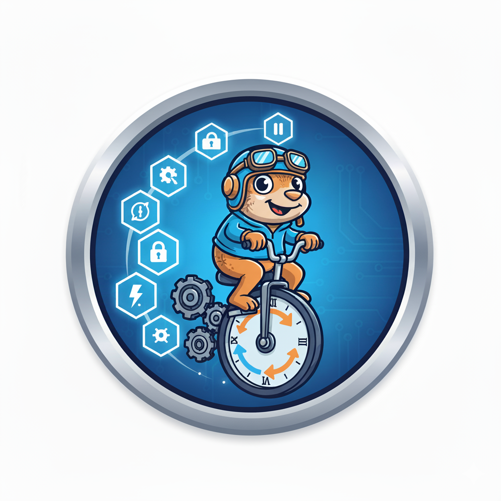

# GopherFlow

Small, pragmatic workflow engine for Go with a built-in web console. Define workflows in Go, persist their execution, and observe/operate them via the web UI.

## Highlights

- Define workflows in Go using a state-machine approach
- Persistent storage (Postgres, SQLite, Mysql supported) with action history
- Concurrent execution with executor registration, heartbeats, and stuck-workflow repair
- Web console (dashboard, search, definitions with diagrams, executors, details)
- Mermaid-like flow visualization generated from workflow definitions
- Container-friendly, single-binary deployment

## Quick start

Prerequisites:
- Go 1.24+ (or Docker if you prefer containers)

## Hello World
Run locally:

