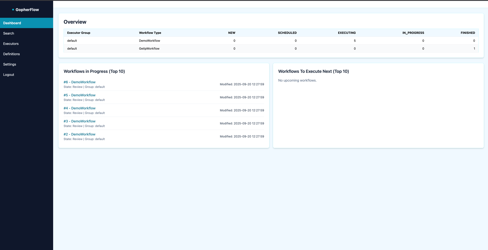
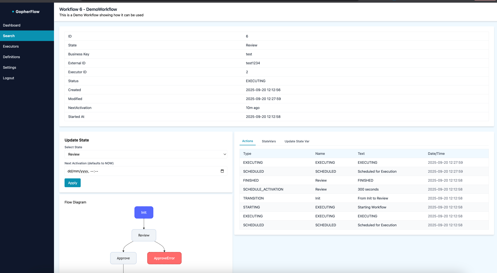
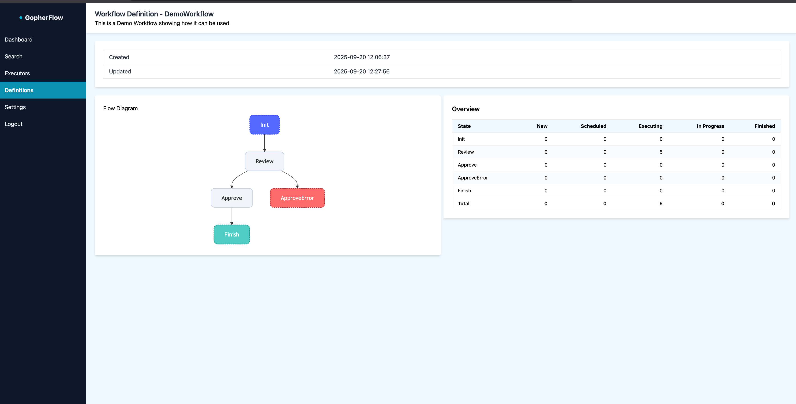

# GopherFlow

[](https://github.com/RealZimboGuy/gopherflow/actions/workflows/ci.yml)
[](https://pkg.go.dev/github.com/RealZimboGuy/gopherflow)
[](https://github.com/RealZimboGuy/gopherflow/blob/master/go.mod)
[](https://hub.docker.com/r/juliangpurse/gopherflow)
[](LICENSE)

**Temporal-style durable workflows without running Temporal.**

<p align="center"></p>

Write workflows as plain Go structs. Every state transition is persisted to a database you already run — Postgres, MySQL or SQLite — so workflows survive restarts, crashes and deploys, and resume from where they stopped. The engine, the REST API and the web console are a library you import into your own binary: no control-plane cluster, no broker, no sidecar, no separate worker fleet to operate.

```
go get github.com/RealZimboGuy/gopherflow@v1.9.0
```

## Why GopherFlow

- **One static binary, one database.** `gopherflow.Setup(registry)` in your `main()` gives you the engine, the API and the console. Schema migrations run themselves on start. Pure Go, no cgo — the container runs under the default seccomp profile and cross-compiles without a C toolchain.
- **No determinism rules to learn.** States are ordinary Go methods that return the next state. Keep them idempotent and the engine handles persistence, retry and backoff — there is no replay model and no workflow-versioning trap.
- **Operable on day one.** Dashboard, search, per-workflow action history, live executor list, and a flow diagram generated from the definition with the executed path overlaid.
- **Scale by starting another copy.** Executors register in the database, heartbeat, and repair each other's stuck workflows. Adding capacity means running your binary again.

## How it compares

|                             | **GopherFlow**              | **Temporal (self-hosted)**                                                    | **Dagu**                      | **Hand-rolled cron + DB** |
| --------------------------- | --------------------------- | ----------------------------------------------------------------------------- | ----------------------------- | ------------------------- |
| What you operate            | your binary + a DB          | frontend / history / matching / worker services, a DB, often Elasticsearch, plus your own workers | one binary + files on disk    | your binary + a DB        |
| How workflows are defined   | Go structs and methods      | Go / Java / TS / Python SDK, replay-deterministic code                         | YAML DAGs of commands         | however you write them    |
| Durable state, retry, resume| built in                    | built in                                                                      | per-step retry and run history| you build it              |
| Web console                 | built in                    | built in (separate UI service)                                                | built in                      | you build it              |
| Parent / child, parallel fan-out | yes                    | yes, plus signals, queries, timers, sagas                                     | DAG deps and nested DAGs      | you build it              |
| What you have to learn      | one Go interface            | determinism, versioning, task queues                                          | the YAML schema               | nothing, until it grows   |
| Scale ceiling               | thousands of workflows/min against one DB | very high, multi-cluster                                        | single-node scheduler         | whatever you build        |

Choose **Temporal** if you need signals and queries, workers in several languages, or scale that outgrows a single database. Choose **Dagu** if your steps are shell commands on a schedule rather than Go code. Choose **GopherFlow** if you want durable, retryable, observable business workflows written in Go — without operating another distributed system to get them.

## Highlights

- Define workflows in Go using a state-machine approach
- each function is idempotent and can be retried
- Persistent storage (Postgres, SQLite, Mysql supported) with action history
- Concurrent execution with executor registration, heartbeats, and stuck-workflow repair
- Web console (dashboard, search, definitions with diagrams, executors, details)
- Mermaid-like flow visualization generated from workflow definitions
- Container-friendly, single-binary deployment
- Parent / Child Workflows
- - GopherFlow supports parent workflows spawning child workflows, allowing for parallel execution and coordination.
- - **Spawn Children**: A parent workflow can create multiple child workflow requests.
- - **Wait & Wake**: The parent can wait for children to complete. Children can explicitly wake their parent when they reach a certain state or finish.
- - **Parallel Execution**: Child workflows run independently and in parallel.


## Quick start

Prerequisites:
- Go 1.26+ (or Docker if you prefer containers)

## Demo Application
This starts the demo application with a SQLite database, there are two workflows

* DemoWorkflow - does some ficticious steps and adds some variables
* GetIpWorkflow - gets the current public IP address from ifconfig.io and puts it into a state variable

        docker run -p 8080:8080 \
        -e GFLOW_DATABASE_TYPE=SQLLITE \
        -e GFLOW_DATABASE_SQLLITE_FILE_NAME=/data/gflow.db \
        -v "$(pwd):/data" \
        juliangpurse/gopherflow:1.9.0

Access the web console at http://localhost:8080/

    Username : admin
    Password : admin

## Web Console

<p align="center">



</p>

## REST API

GopherFlow provides a REST API for programmatic interaction with workflows. A Postman collection is available in the `postman` directory to help you get started:

- **Collection File**: in the `postman/` directory
- **API Key Authentication**: All endpoints use an `X-API-Key` header for authentication, check users tab in the web ui for the api key

### Available Endpoints:

1. **Get Workflow Definitions** - `GET /api/definitions`
2. **Create Workflow** - `POST /api/workflows`
3. **Get Workflow Details** - `GET /api/workflows/{id}`
4. **Get Workflow by External ID** - `GET /api/workflowByExternalId/{externalId}`
5. **Search Workflows** - `POST /api/workflows/search`
6. **Create and Wait** - `POST /api/createAndWait` - Create a workflow and wait for it to reach specific states
7. **Update State and Wait** - `POST /api/workflows/{externalId}/stateAndWait` - Update a workflow's state and wait for it to reach specific states

To use the Postman collection:
1. Import the collection into Postman
2. Configure your environment variables (if needed)
3. Use the pre-configured requests to interact with your GopherFlow instance


### Performance
* Tested to a few thousand simple workflows per minute with the concurrent workers increased, see system settings (ENGINE_CHECK_DB_INTERVAL, ENGINE_BATCH_SIZE and ENGINE_EXECUTOR_SIZE )
* Something to note, there are no official records of this to put on the repo.... why:
    * at a certain point if you need raw throughput, you dont need a workflow engine and will hand tool the code.
    * if you are chasing performance to that level, the convenience of a framework like GopherFlow is not worth it.
    * if you have complicated Directed Acyclic Graphs (DAGs) you will most likely need a workflow engine, in that case your executions per minute is more limited by external factors like APIs you are calling, database performance, etc.
    * having a workflow engine gives a single place for workflows to live and makes the trivial things like persistence, retry and observability easier.
* these are mostly the rants of the developer :) take it with some salt.


## Building your own Workflow and running it

refer to the example application:  https://github.com/RealZimboGuy/gopherflow-examples

### Specific details

    go get github.com/RealZimboGuy/gopherflow@v1.9.0

a struct that extends the base 
```go
type GetIpWorkflow struct {
    core.BaseWorkflow
}
```
the workflow interface must be fully implemented

```go
type Workflow interface {
    StateTransitions() map[string][]string // map of state name -> list of next state names
    InitialState() string // where to start
    Description() string
    Setup(wf *domain.Workflow)
    GetWorkflowData() *domain.Workflow
    GetStateVariables() map[string]string
    GetAllStates() []models.WorkflowState 
    GetRetryConfig() models.RetryConfig
}

```
### Here is the example for the GetIpWorkflow

```go
import (
    "github.com/RealZimboGuy/gopherflow/pkg/gopherflow/core"
    domain "github.com/RealZimboGuy/gopherflow/pkg/gopherflow/domain"
    models "github.com/RealZimboGuy/gopherflow/pkg/gopherflow/models"

    "io"
    "log/slog"
    "net/http"
    "time"
)

// Define a named string type
var StateStart string = "Start"
var StateGetIpData string = "StateGetIpData"

const VAR_IP = "ip"

type GetIpWorkflow struct {
core.BaseWorkflow
}

func (m *GetIpWorkflow) Setup(wf *domain.Workflow) {
    m.BaseWorkflow.Setup(wf)
}
func (m *GetIpWorkflow) GetWorkflowData() *domain.Workflow {
    return m.WorkflowState
}
func (m *GetIpWorkflow) GetStateVariables() map[string]string {
    return m.StateVariables
}
func (m *GetIpWorkflow) InitialState() string {
    return StateStart
}

func (m *GetIpWorkflow) Description() string {
    return "This is a Demo Workflow showing how it can be used"
}

func (m *GetIpWorkflow) GetRetryConfig() models.RetryConfig {
    return models.RetryConfig{
        MaxRetryCount:    10,
        RetryIntervalMin: time.Second * 10,
        RetryIntervalMax: time.Minute * 60,
    }
}

func (m *GetIpWorkflow) StateTransitions() map[string][]string {
    return map[string][]string{
        StateStart:     []string{StateGetIpData}, // Init -> StateGetIpData
        StateGetIpData: []string{StateFinish},    // StateGetIpData -> finish
    }
}
func (m *GetIpWorkflow) GetAllStates() []models.WorkflowState {
    states := []models.WorkflowState{
        {Name: StateStart, StateType: models.StateStart},
        {Name: StateGetIpData, StateType: models.StateNormal},
        {Name: StateFinish, StateType: models.StateEnd},
    }
    return states
}

// Each method returns the next state
func (m *GetIpWorkflow) Start(ctx context.Context) (*models.NextState, error) {

    //use the Context slog because there are workerids and other fields in the context that get written by the logger
    slog.InfoContext(ctx,"Starting workflow")

    return &models.NextState{
        Name:      StateGetIpData,
        ActionLog: "using ifconfig.io to return the public IP address",
    }, nil
}

func (m *GetIpWorkflow) StateGetIpData(ctx context.Context) (*models.NextState, error) {
    resp, err := http.Get("http://ifconfig.io")
    if err != nil {
        return nil, err
    }
    defer resp.Body.Close()

    ipBytes, err := io.ReadAll(resp.Body)
    if err != nil {
        return nil, err
    }
    ip := string(ipBytes)
    m.StateVariables[VAR_IP] = ip

    return &models.NextState{
        Name: StateFinish,
    }, nil
}
```

### Main function
```go
import (
    "context"
    "log/slog"
    
    "github.com/RealZimboGuy/gopherflow/internal/workflows"
    "github.com/RealZimboGuy/gopherflow/pkg/gopherflow"
)
    
func main() {
    //you may do your own logger setup here or use this default one with slog
    ctx := context.Background()
    
    gopherflow.SetupLogger(slog.LevelInfo)
    
    workflowRegistry := map[string]func() core.Workflow{
        "DemoWorkflow": func() core.Workflow {
            return &workflows.DemoWorkflow{}
        },
        "GetIpWorkflow": func() core.Workflow {
            // You can inject dependencies here
            return &workflows.GetIpWorkflow{
                // HTTPClient: httpClient,
                // MyService: myService,
            }
        },
    }
    //uses the defaul ServeMux
    app := gopherflow.Setup(workflowRegistry)
    
    if err := app.Run(ctx); err != nil {
        slog.Error("Engine exited with error", "error", err)
    }
}
```

### Example: Spawning Children

In your parent workflow state transition:

```go
func (w *MyParentWorkflow) SpawnChildren(ctx context.Context) (*models.NextState, error) {
    // Create child workflow requests.
    // Signature: CreateChildWorkflowRequest(workflowType, businessKey, stateVars).
    // The child's initial state is taken from the child workflow's own InitialState();
    // the engine assigns an externalId automatically.
    childRequests := []models.ChildWorkflowRequest{
        gopherflow.CreateChildWorkflowRequest(
            "MyChildWorkflow",
            fmt.Sprintf("child-%d", w.WorkflowState.ID),
            map[string]string{"input": "value"},
        ),
    }

    return &models.NextState{
        Name:           "WaitForChildren",
        ChildWorkflows: childRequests,
    }, nil
}
```

### Example: Waiting for Children

```go
func (w *MyParentWorkflow) WaitForChildren(ctx context.Context) (*models.NextState, error) {
    children, err := w.GetChildWorkflows(ctx)
    if err != nil {
        return nil, err
    }

    allComplete := true
    for _, child := range children {
        if child.Status != models.WorkflowStatusFinished {
            allComplete = false
            break
        }
    }

    if !allComplete {
        // Wait and check again later
        return &models.NextState{
            Name:                "WaitForChildren",
            NextExecutionOffset: "1 minute",
        }, nil
    }

    return &models.NextState{Name: "Finish"}, nil
}
```
